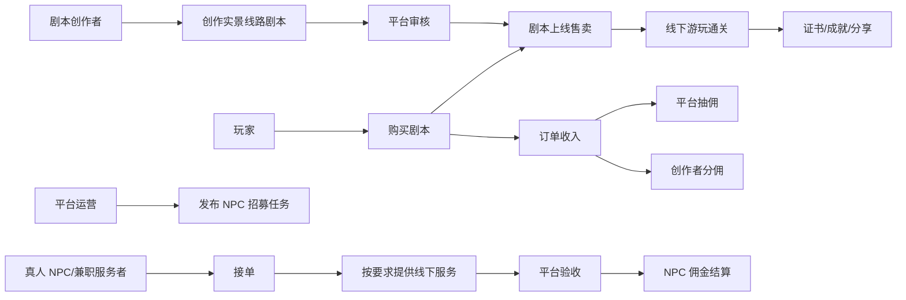
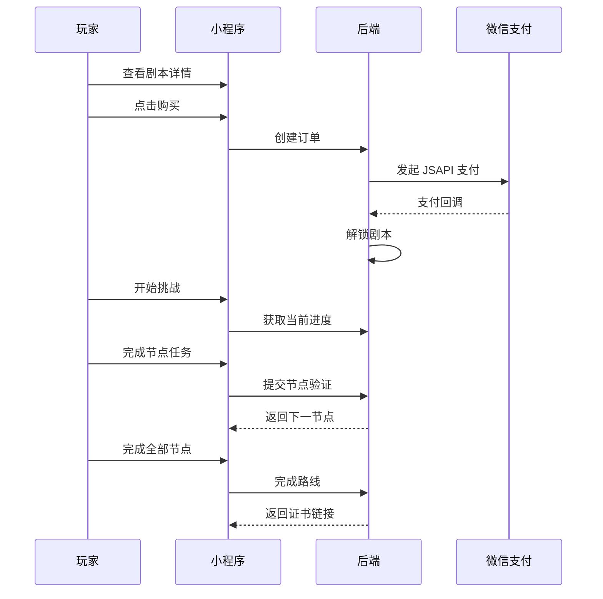
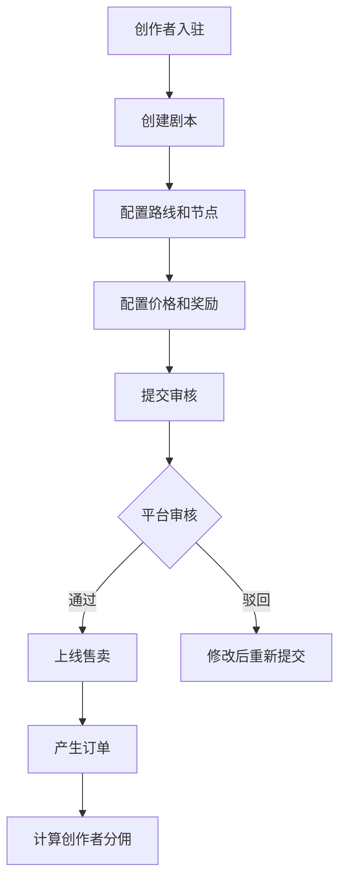
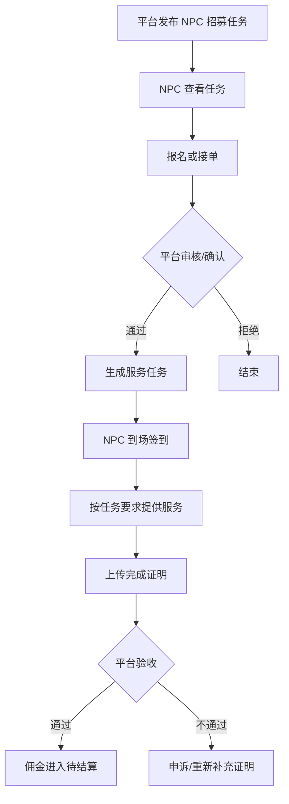
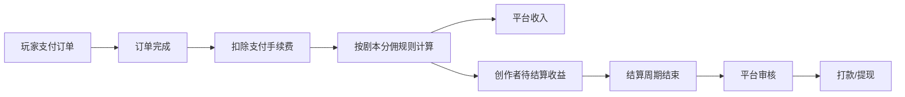

# 城市探秘平台版产品架构文档

## 1. 项目定位

城市探秘是一个基于微信小程序的 LBS 城市实景剧本娱乐平台。

玩家购买城市剧本后，根据 GPS 定位在真实城市空间中完成剧情任务，通过打卡、答题、拍照、扫码、真人 NPC 互动等方式推进剧情，最终完成通关并获得证书、成就卡和可分享内容。

平台的最终形态不是单一自营剧本小程序，而是一个连接玩家、剧本创作者、真人 NPC 服务者和平台运营方的城市实景内容交易平台。

## 2. 核心商业闭环



平台收入来源：

- 剧本销售抽佣
- 自营剧本收入
- 城市活动定制收入
- 商家联动与线下导流收入
- 创作者工具或增值服务

平台支出来源：

- 创作者分佣
- 真人 NPC 任务佣金
- 线下执行成本
- 支付通道手续费
- 内容审核与客服成本

## 3. 用户角色

### 玩家

玩家是内容消费方。

核心能力：

- 浏览城市剧本
- 购买剧本
- 开始挑战
- GPS 打卡
- 答题解谜
- 上传照片
- 扫描二维码
- 与真人 NPC 互动
- 查看进度
- 获得证书、勋章、通关记录
- 分享成就卡、海报、路线成果

### 剧本创作者

创作者是内容供给方。

核心能力：

- 入驻申请
- 创建剧本
- 配置城市路线
- 配置任务节点
- 配置剧情文本
- 配置 GPS、QA、PHOTO、QR、NPC 等节点类型
- 设置预计时长、距离、难度、价格
- 提交审核
- 查看审核结果
- 查看销售数据
- 查看分佣收益
- 发起提现或结算申请

### 真人 NPC / 兼职服务者

真人 NPC 是线下体验服务供给方。

核心能力：

- 查看平台招募任务
- 提交报名资料
- 接单
- 查看任务要求
- 查看服务时间与地点
- 到场签到
- 上传服务完成证明
- 接收平台验收结果
- 查看佣金
- 发起提现或结算

### 平台管理员

管理员负责平台运营、审核、结算和风控。

核心能力：

- 路线管理
- 节点管理
- 剧本审核
- 创作者管理
- NPC 招募任务管理
- NPC 接单审核
- 订单管理
- 分佣规则管理
- 结算管理
- 投诉与风控处理
- 数据统计

## 4. 系统端划分

### 玩家小程序

面向玩家使用。

核心模块：

- 首页与城市切换
- 剧本列表
- 剧本详情
- 购买与支付
- 游戏任务页
- 地图导航
- 节点验证
- 进度保存
- 通关证书
- 成就与分享
- 我的订单
- 我的挑战记录

V1 重点：

- 重庆单路线《山城迷城计划：消失的山城核心》
- mock 登录
- mock 支付
- mock 照片通过
- mock 扫码通过
- 本地完整通关

### 创作者后台

面向剧本创作者。

核心模块：

- 创作者入驻
- 创作者资料
- 剧本工作台
- 路线编辑器
- 节点编辑器
- 剧情编辑
- 任务配置
- 价格配置
- 提交审核
- 审核反馈
- 销售数据
- 收益数据
- 结算记录

关键原则：

- 剧本必须由配置驱动
- 路线、节点、任务、奖励不能写死在业务逻辑中
- 创作者只能编辑自己拥有的剧本
- 审核通过前不能上线售卖

### NPC 任务端

可先作为小程序内的兼职入口，后续也可独立为 NPC 服务者端。

核心模块：

- NPC 招募任务列表
- 任务详情
- 报名/接单
- 服务要求
- 到场签到
- 任务完成证明
- 平台验收状态
- 佣金记录
- 提现记录

NPC 任务类型：

- 固定地点互动 NPC
- 剧情线索交付
- 角色扮演
- 活动引导
- 拍照协助
- 商家联动接待
- 夜间特殊任务服务

### 平台管理后台

面向平台运营人员。

核心模块：

- 管理员登录
- 玩家管理
- 创作者管理
- 剧本管理
- 剧本审核
- 路线与节点管理
- NPC 招募发布
- NPC 报名审核
- NPC 排班与任务验收
- 订单管理
- 支付记录
- 分佣规则
- 结算管理
- 数据统计
- 投诉处理
- 黑名单管理

### 分佣结算系统

连接订单收入、创作者收益和 NPC 服务佣金。

核心模块：

- 订单收入记录
- 平台抽佣规则
- 创作者分佣计算
- NPC 任务佣金计算
- 结算周期
- 待结算金额
- 已结算金额
- 提现申请
- 打款记录
- 异常冻结
- 对账记录

## 5. 核心业务流程

### 玩家购买游玩流程



### 创作者剧本上线流程



### NPC 招募接单流程



### 创作者分佣流程



## 6. 路线配置引擎

所有剧本都必须由后台配置生成。

剧本结构：

```json
{
  "questId": 1,
  "season": "S1",
  "title": "山城迷城计划：消失的山城核心",
  "city": "重庆",
  "price": 39.9,
  "duration": 180,
  "distance": 5.8,
  "difficulty": "进阶",
  "nodes": [
    {
      "nodeId": 1,
      "chapter": "第一章",
      "type": "photo",
      "title": "消失的档案",
      "locationName": "解放碑",
      "lat": 29.56301,
      "lng": 106.57712,
      "radius": 80,
      "content": "找到 1938 年老照片的同角度位置。",
      "objective": "拍摄同角度照片",
      "reward": {
        "badge": "时间裂缝发现者",
        "shareTitle": "我找到了1938年的重庆"
      }
    }
  ]
}
```

节点类型：

- GPS：到达指定坐标半径内
- QA：输入正确答案
- PHOTO：上传照片或模拟通过
- QR：扫描二维码验证
- NPC：与真人 NPC 完成互动或服务确认
- COMPOSITE：多条件组合节点，后续版本支持

## 7. NPC 任务机制

NPC 任务不是玩家任务节点本身，而是平台为了支撑线下体验而发布的服务任务。

NPC 任务字段：

- 任务标题
- 所属城市
- 关联剧本
- 关联节点
- 服务地点
- 服务时间
- 招募人数
- 角色要求
- 服装/道具要求
- 服务话术
- 完成标准
- 佣金金额
- 报名截止时间
- 验收方式
- 风险提示
- 联系方式

NPC 任务状态：

- draft：草稿
- recruiting：招募中
- assigned：已派单
- checked_in：已签到
- submitted：待验收
- completed：已完成
- rejected：验收驳回
- settled：已结算
- cancelled：已取消

NPC 验收方式：

- GPS 到场签到
- 照片证明
- 玩家确认码
- 管理员人工审核
- 商家确认
- 多方组合验证

## 8. 审核机制

### 剧本审核

审核范围：

- 内容合法合规
- 地点是否适合公开引导
- 路线安全性
- 任务是否可执行
- 是否侵犯第三方权益
- 是否存在危险行为
- 是否过度打扰商家或居民
- 价格是否异常
- 剧情是否符合平台调性

审核结果：

- 通过
- 驳回修改
- 禁止上线
- 下架整改

### 创作者审核

审核范围：

- 身份信息
- 联系方式
- 收款信息
- 内容历史
- 违规记录

### NPC 审核

审核范围：

- 基础身份资料
- 联系方式
- 服务能力
- 到场可靠性
- 违规记录
- 特定角色要求

## 9. 分佣与结算

### 剧本销售分佣

示例规则：

- 玩家支付金额：39.90 元
- 微信支付手续费：按实际通道费率扣除
- 平台抽佣：30%
- 创作者分佣：70%

可配置维度：

- 按剧本配置
- 按创作者等级配置
- 按活动配置
- 按城市代理配置
- 按渠道来源配置

### NPC 佣金结算

NPC 佣金来自平台任务预算，不直接等同于玩家订单收入。

结算条件：

- NPC 已接单
- 已按要求签到
- 已提交完成证明
- 平台验收通过
- 无投诉或投诉已处理

结算状态：

- pending：待结算
- frozen：冻结中
- payable：可结算
- paid：已打款
- rejected：拒绝结算

### 财务风控

需要支持：

- 异常订单冻结
- 退款后分佣回滚
- 投诉期间冻结
- 虚假完成证明处罚
- NPC 爽约扣罚
- 创作者违规下架
- 结算人工复核

## 10. 数据域设计

现有 V1 数据域：

- users
- quests
- quest_nodes
- orders
- user_progress
- finish_records
- admins
- quest_audit_logs

平台版新增数据域建议：

- creators：创作者
- creator_profiles：创作者资料
- creator_quests：创作者与剧本关系
- commission_rules：分佣规则
- commission_records：分佣记录
- settlement_batches：结算批次
- settlement_records：结算明细
- npc_profiles：NPC 资料
- npc_jobs：NPC 招募任务
- npc_job_applications：NPC 报名记录
- npc_assignments：NPC 派单记录
- npc_checkins：NPC 签到记录
- npc_submissions：NPC 完成证明
- npc_settlements：NPC 佣金结算
- complaints：投诉记录
- risk_logs：风控记录

## 11. 权限设计

### 游客

- 浏览公开剧本
- 查看剧本详情

### 普通玩家

- 购买剧本
- 挑战剧本
- 查看证书
- 查看订单
- 报名开放型 NPC 任务，需补充资料后升级为 NPC 服务者

### 创作者

- 管理自己的剧本
- 提交审核
- 查看收益
- 申请结算

### NPC 服务者

- 查看可接任务
- 接单
- 签到
- 提交完成证明
- 查看佣金

### 平台管理员

- 全平台内容管理
- 审核管理
- 订单管理
- 结算管理
- 风控管理
- 数据统计

## 12. 版本规划

### V1：玩家端单路线闭环

目标：验证玩家付费与完赛率。

范围：

- 重庆《山城迷城计划：消失的山城核心》
- 玩家浏览、购买、游玩、通关
- GPS、QA、PHOTO、QR 节点
- mock 登录与 mock 支付
- 通关证书
- 管理后台路线和节点 CRUD
- 基础审核状态

暂不做：

- 创作者入驻
- 创作者收益
- NPC 招募
- 真实分佣打款
- 商家中心
- 社区
- AI 剧情生成
- AR 玩法

### V2：创作者平台

目标：让外部创作者可以提交实景线路剧本。

范围：

- 创作者入驻
- 创作者后台
- 剧本编辑器
- 路线节点配置
- 提交审核
- 审核流
- 剧本销售统计
- 分佣规则
- 创作者结算记录

### V3：NPC 任务平台

目标：让平台可以组织真人 NPC 服务，提升沉浸式体验。

范围：

- NPC 资料
- NPC 招募任务发布
- NPC 报名与接单
- 到场签到
- 服务证明
- 平台验收
- NPC 佣金结算
- 投诉与处罚

### V4：平台规模化

目标：支持多城市、多创作者、多玩法扩展。

范围：

- 城市运营后台
- 商家联动任务
- 排行榜
- 分享海报
- 视频轨迹
- 创作者等级
- 内容模板市场
- 高级数据分析

## 13. 当前开发建议

短期仍以 V1 闭环为主。

下一步建议：

1. 保持玩家端《山城迷城计划》完整可玩。
2. 把路线配置字段向平台版结构靠拢，提前预留 `creatorId`、`reward`、`reviewStatus`、`commissionRuleId`。
3. 后台管理先增加“创作者”和“NPC 任务”的数据模型草案，不急着做完整页面。
4. 等 V1 可演示后，再开始 V2 创作者平台后台。
5. NPC 任务平台放在 V3，但现在需要把 `NPC` 作为未来节点类型纳入路线引擎设计。

